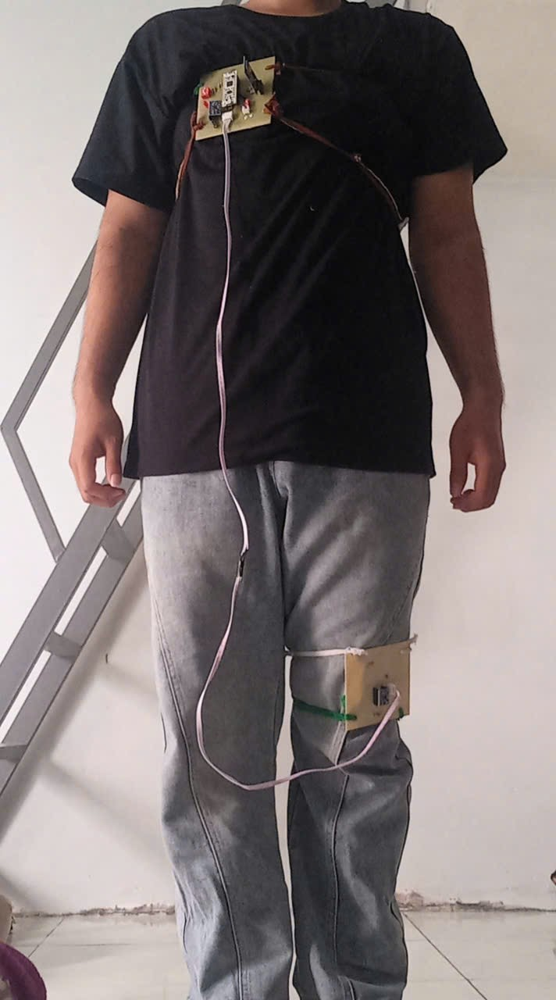
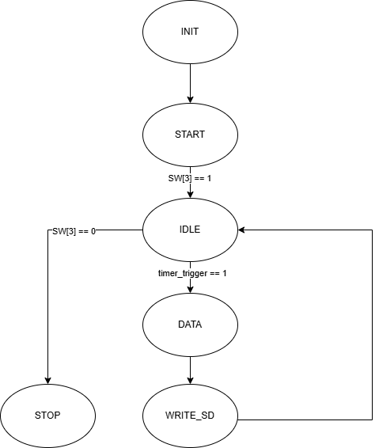
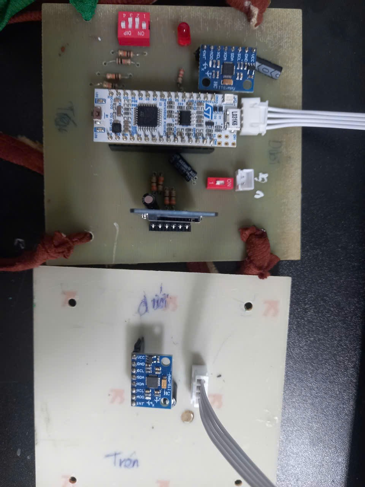

# Posture prediction based on STM32L031 collector

## Program base FSM

## PCB available at

https://drive.google.com/drive/folders/18wd474qoULa9VAvKOj7D7beHALQpp06f?usp=sharing

## Data available:

https://drive.google.com/drive/folders/1lwTvIWg39uqETlzpsQS6dVpFMPa7IrEi?usp=sharing

## Usage:

Start set theo D9 pin - SW to 1 (that mean GPIO will read 0 because of the pull of is get connected to GND).

While start up, if you have not change the state of the SW but the RED LED turn on (it means that there will be a weak connection between the STM32 and the SDCARD, so that the SDCARD can not be mounted, to resolve reconnect the SD card and RESET the circuit).

If the start up hold about 2 seconds normally, now you can start record the signal. Set the SWs of pin D10-D12 to write the posture code (SW to 1 mean that GPIO read 0 due to pullup) and turn SW-D9 to 0 (GPIO read 1) - then start session (the LED will turn on).

When end the record session turn the SW of D9 to 1 (GPIO read 0), the LED will turn off that mean the session is record 

The datas will bee save in POSTURE.BIN. Data format will be:
[Timestamp (using HAL), Ax1, Ay1, Az1, Gx1, Gy1, Gz1, Ax2, Ay2, Az2, Gx2, Gy2, Gz2, Posture], where Posture is an integer label ranging from 0 to 5, corresponding to the following body postures: 0 – standing, 1 – sitting, 2 – sleeping, 3 – running, 4 – forward bending, and 5 – backward bending.

## Achievement: 

The pipeline achieved above 98% macro F1 in test set.

## Data available: 

https://drive.google.com/drive/folders/1lwTvIWg39uqETlzpsQS6dVpFMPa7IrEi?usp=sharing

